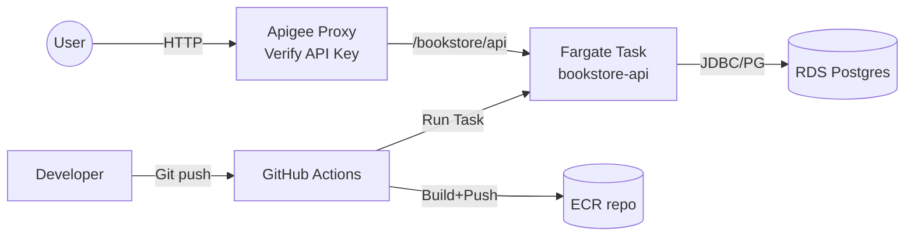
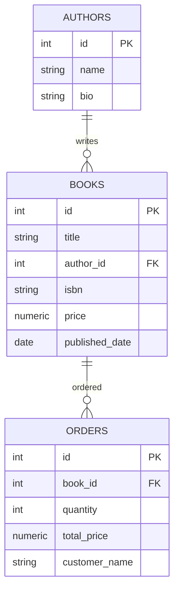

# Architecture and Data Model

## System Architecture

```mermaid
flowchart LR
  User((User)) -->|HTTP| Apigee[Apigee Proxy\nVerify API Key]
  Apigee -->|/bookstore/api| ECS[Fargate Task\nbookstore-api]
  ECS -->|JDBC/PG| RDS[(RDS Postgres)]
  Dev[Developer] -->|Git push| GH[GitHub Actions]
  GH -->|Build+Push| ECR[(ECR repo)]
  GH -->|Run Task| ECS
```

## ER Diagram

```mermaid
erDiagram
  AUTHORS ||--o{ BOOKS : writes
  BOOKS ||--o{ ORDERS : ordered
  AUTHORS {
    int id PK
    string name
    string bio
  }
  BOOKS {
    int id PK
    string title
    int author_id FK
    string isbn
    numeric price
    date published_date
  }
  ORDERS {
    int id PK
    int book_id FK
    int quantity
    numeric total_price
    string customer_name
  }
```